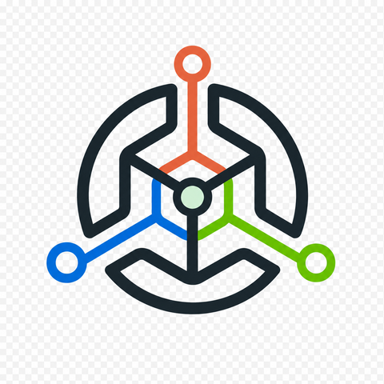
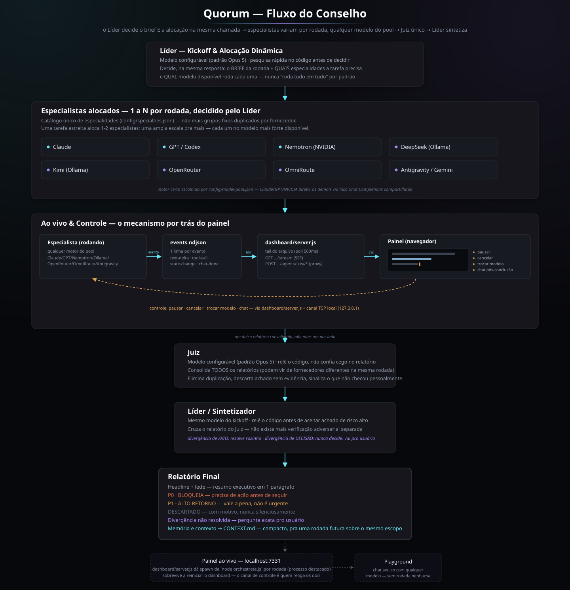

<p align="center">
  
</p>

<h1 align="center">Quorum</h1>

<p align="center"><strong>Conselho local multi-modelo para revisão de software com evidência, síntese e controle de custo.</strong></p>

<p align="center">
  
  
  
  
  
  
</p>

O Quorum coloca agentes de fornecedores diferentes sobre o mesmo problema, confina as ferramentas ao projeto, e entrega uma síntese única. A cada rodada, o Líder decide dinamicamente **quais especialidades a tarefa precisa** e **qual modelo disponível é mais forte em cada uma** — uma revisão estreita ("revisar só segurança") aloca só 1-2 especialistas, não o catálogo inteiro. Um provedor sem instalação, login, modelo ou quota fica como `skipped`; os demais continuam.

## Destaques

- Alocação dinâmica de especialistas: o catálogo de especialidades (`config/specialties.json`) é único, não duplicado por fornecedor — o Líder escolhe quantidade e modelo por rodada, com base numa matriz de força conhecida por modelo.
- Juiz e Líder/Sintetizador configuráveis: escolha no painel (ou em `config/routing.json`) qual modelo julga e qual sintetiza, além de fixar (“pin”) um modelo específico para qualquer especialidade.
- Rede plugável com Claude Code, Codex, NVIDIA/Nemotron, DeepSeek, Kimi, Antigravity/Gemini, **OpenRouter** e **OmniRoute**.
- Perfil comunitário gratuito realista: execução local ou free tier, sem fallback pago automático.
- Skills versionadas para segurança, qualidade, performance, economia de tokens, design de produto e refinamento visual.
- Painel premium e responsivo com diagnóstico de modelos, configuração do conselho e disponibilidade em tempo real.

## Provedores

| Provedor | Transporte | Perfil de uso |
|---|---|---|
| Claude | `claude -p` | sessão local autenticada |
| OpenAI/Codex | `codex exec` | sessão local autenticada |
| NVIDIA/Nemotron | NIM compatível com OpenAI | free tier, exige `NVIDIA_API_KEY` |
| DeepSeek | Ollama `deepseek-r1:8b` | local, sem custo por token |
| Kimi | Ollama Cloud `kimi-k2.6:cloud` | plano Free, sujeito à quota |
| Antigravity/Gemini | `agy` headless | quota da conta Antigravity |
| OpenRouter | API cloud compatível com OpenAI | free tier (modelos `:free`), exige `OPENROUTER_API_KEY` |
| OmniRoute | Gateway local (`npm install -g omniroute`) | zero-config, agrega dezenas de provedores free |

Nenhum papel é fixo por provedor — qualquer modelo disponível pode ser alocado para qualquer especialidade, ou escolhido como Juiz/Líder. “Gratuito” significa execução no hardware local ou uma quota gratuita oferecida pelo provedor. Quotas e modelos cloud podem mudar; rode o diagnóstico antes de uma revisão importante.

## Como rodar

Requer Node.js 20 ou mais recente.

```bash
npm run install:all
npm run doctor
npm run dashboard
```

Abra [http://127.0.0.1:7331](http://127.0.0.1:7331). O servidor escuta somente no loopback por padrão.

### Ativar os conselheiros gratuitos

1. Instale o [Ollama](https://ollama.com/download) e prepare o DeepSeek:

   ```bash
   ollama pull deepseek-r1:8b
   ```

2. Para Kimi, autentique a conta Free e prepare o modelo cloud:

   ```bash
   ollama signin
   ollama pull kimi-k2.6:cloud
   ```

3. Instale o [Antigravity CLI](https://www.antigravity.google/download), execute `agy` uma vez e conclua o login. O Quorum usa o modo headless oficial com sandbox e não habilita `--dangerously-skip-permissions`.
4. Para o OpenRouter, gere uma chave em [openrouter.ai](https://openrouter.ai/) e defina `OPENROUTER_API_KEY`.
5. Para o OmniRoute, instale e rode o gateway local (`npm install -g omniroute && omniroute`) — funciona zero-config, sem chave obrigatória.

O painel mostra quais integrações estão prontas. Não armazene chaves no repositório; use o ambiente do sistema ou um `.env` local ignorado pelo Git.

<details>
<summary><strong>Chaves de API opcionais</strong></summary>

<br>

| Variável | Quando é necessária |
|---|---|
| `NVIDIA_API_KEY` | Para habilitar o especialista NVIDIA/Nemotron. |
| `OPENROUTER_API_KEY` | Para habilitar modelos do OpenRouter. |
| `OMNIROUTE_BASE_URL` / `OMNIROUTE_API_KEY` | Só se o gateway OmniRoute rodar em outro host/porta, ou exigir chave. |
| `ANTHROPIC_API_KEY` | Somente ao trocar `claude_provider` para `claude-api`. |
| `OPENAI_API_KEY` | Somente ao trocar `openai_provider` para `openai-api`. |

</details>

## Fluxo

1. O Líder faz o kickoff: pesquisa rápida no escopo, monta o brief da rodada e decide a **alocação dinâmica** — quais especialidades do catálogo esta tarefa precisa e qual modelo disponível roda cada uma (respeitando pins definidos no painel "Configurar Conselho").
2. Os especialistas alocados rodam em paralelo — podem ser de fornecedores diferentes na mesma rodada.
3. Um **Juiz único** (modelo configurável) consolida todos os relatórios, elimina duplicação e descarta achados sem evidência.
4. O Líder cruza o relatório do Juiz, verifica achados de alta severidade, mantém divergências decisórias abertas e grava `runs/<run-id>/FINAL_REPORT.md`.

<p align="center">
  
</p>

Também é possível rodar sem o painel:

```bash
node orchestrate.js --scope /caminho/do/projeto --task "revisar segurança e qualidade" --run-id minha-revisao --out runs/minha-revisao
```

Para limitar os conselheiros opcionais:

```bash
node orchestrate.js --scope /projeto --task "revisar" --run-id run-1 --out runs/run-1 --providers '["deepseek-local","openrouter-free"]'
```

## Ao vivo, chat e controle da rodada

Clicar num especialista abre três abas na barra lateral:

- **Achados** — o que já foi relatado (como antes).
- **Ao vivo** — transmissão em tempo real via SSE. Ollama, NVIDIA, OpenRouter e OmniRoute transmitem texto token a token de verdade (são chamadas de API sob nosso controle); Claude Code local e Codex local mostram só início/fim de cada chamada de ferramenta e o texto completo quando termina — eles rodam como processo único e não têm streaming disponível sem trocar pro modo `-api` (cobrado por token).
- **Chat** — depois que o especialista conclui, dá pra fazer perguntas de acompanhamento sobre o relatório dele (reaproveita o que ele já viu, sem reabrir o código do zero).

Um especialista `running` ganha três controles no card: **pausar** (aborta e guarda os dados pra retomar — retomar sempre recomeça do zero, nenhum motor tem como continuar de onde parou), **cancelar** (encerra de vez) e um seletor pra **trocar o modelo** no meio da rodada sem reiniciá-la inteira. Limites de um especialista específico também podem ser ajustados em tempo real via `POST /api/runs/:id/agents/:key/limits`.

**Playground** (botão no cabeçalho) abre um chat avulso com qualquer modelo do pool, sem vínculo com nenhuma revisão de código — útil pra testar rápido um modelo antes de confiar uma especialidade a ele.

## Skills incluídas

As skills ficam em `.agents/skills/`, são legíveis e revisáveis como qualquer código. O carregador valida os IDs, bloqueia traversal e injeta somente as skills mapeadas no perfil do agente.

- `security-audit`: vulnerabilidades verificáveis e tratamento seguro de segredos.
- `quality-engineering`: contratos, falhas, testes e critérios de aceite.
- `performance`: gargalos mensuráveis e otimização com comparação antes/depois.
- `token-economy`: contexto progressivo, deduplicação e roteamento econômico.
- `product-design`: fluxos, estados, acessibilidade e redução de esforço cognitivo.
- `visual-polish`: sistema visual coerente e acabamento responsivo.

O formato também é reconhecido como workspace skills pelo Antigravity CLI.

## Segurança e privacidade

| Área | Garantia |
|---|---|
| Ferramentas de API/Ollama | `path-guard`, bloqueio de segredos e allowlist de comandos em `openai-side/src/security/` |
| Codex local | sandbox `read-only` |
| Antigravity | relatórios via `stdin`, sandbox e diretório isolado, sem acesso ao código-fonte nessa etapa |
| Dashboard | limite de requisição, IDs validados, caminhos estáticos normalizados, CSP e bind em `127.0.0.1` |
| Skills | conteúdo do repositório tratado como dado não confiável para reduzir prompt injection |

O free tier do Gemini API pode usar dados para melhoria de produto, conforme a configuração e os termos da conta. Para código confidencial, prefira execução local ou revise as políticas do provedor antes de habilitá-lo.

## Verificação

```bash
npm test
node --check orchestrate.js
```

Os testes cobrem registro de skills, traversal, deduplicação, integridade de configuração e isolamento de falhas entre provedores opcionais.

## Créditos

O Quorum é mantido por [@luizhc06](https://github.com/luizhc06). Os modelos abaixo aparecem no projeto em dois papéis diferentes — vale distinguir, porque não é a mesma coisa:

**Conselheiros** — participam das revisões que o Quorum orquestra. É o produto funcionando, não autoria do repositório:

| Modelo | Fornecedor | Papel no conselho |
|---|---|---|
| Claude (Sonnet 5 / Opus 5) | Anthropic | especialistas, juiz e líder/sintetizador |
| Codex (GPT-5.6) | OpenAI | especialistas espelhados e juiz próprio |
| Nemotron 3 Super 120B | NVIDIA | documentação e legibilidade, fornecedor independente |
| DeepSeek R1 | DeepSeek, via Ollama local | segurança, performance e economia de tokens |
| Kimi K2.6 | Moonshot AI, via Ollama Cloud | qualidade e design |
| Gemini | Google, via Antigravity | revisão cruzada pós-juízes |

**Co-autoria de código** — modelos que ajudaram a escrever o próprio Quorum aparecem como `Co-Authored-By` nos commits em que trabalharam, e por isso somam no painel *Contributors* do GitHub.

A escolha de fornecedores diferentes é deliberada: dois modelos do mesmo fornecedor tendem a errar junto, e o valor do conselho está justamente na discordância.

### Convenção de co-autoria

Um modelo só aparece em *Contributors* se o e-mail do trailer estiver ligado a uma **conta de usuário** do GitHub. Três dos seis têm identidade oficial:

```
Co-Authored-By: Claude <noreply@anthropic.com>
Co-Authored-By: Codex <267193182+codex@users.noreply.github.com>
Co-Authored-By: Gemini <200291788+gemini-code-assist@users.noreply.github.com>
```

Credite **só quem realmente trabalhou naquele commit** — trailer de quem não participou é crédito falso.

**Kimi, DeepSeek e Nemotron ficam de fora dos trailers de propósito.** Seus fornecedores só mantêm *organizações* no GitHub (`moonshotai`, `deepseek-ai`, `nvidia`), e organização não é creditada como co-autora — só conta de usuário é. Eles seguem creditados na tabela de conselheiros acima, que é onde o papel deles realmente está.

> **Não invente e-mail de co-autor.** Vários nomes óbvios pertencem a terceiros sem relação com estas IAs: a conta `kimi` é de uma pessoa física, e `gemini` é a corretora de criptoativos, não o modelo do Google. Um endereço errado credita silenciosamente o commit a um estranho. Na dúvida, resolva o ID real da conta antes:
>
> ```bash
> gh api users/<conta> --jq '"\(.id)+\(.login)@users.noreply.github.com"'
> ```

O repositório traz um template com essas linhas prontas, comentadas. Para ativá-lo:

```bash
git config commit.template .gitmessage
```
